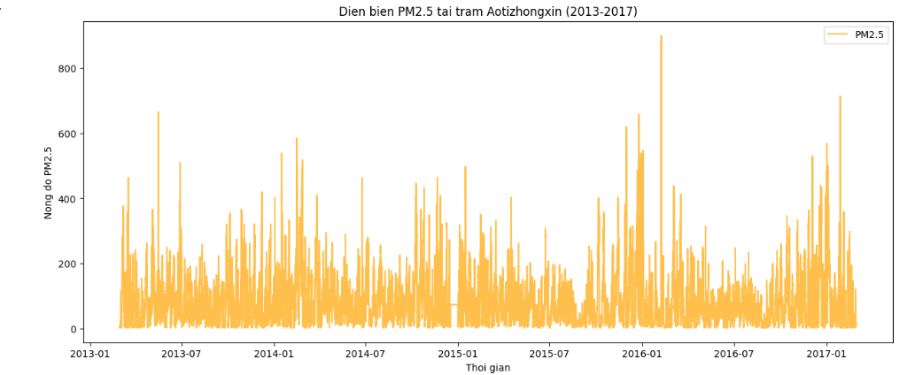
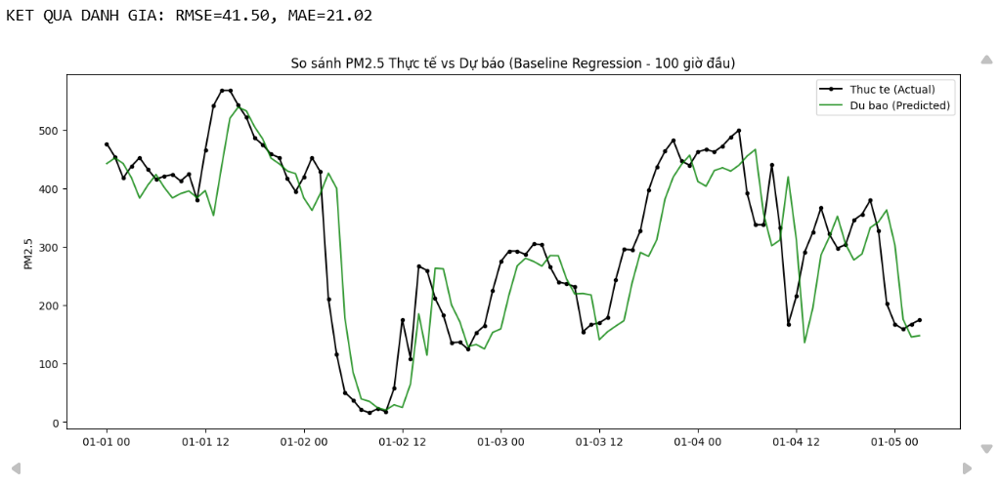
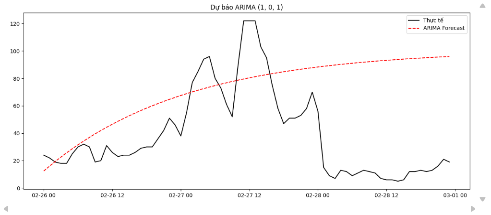

# BÁO CÁO DỰ ÁN: DỰ BÁO CHẤT LƯỢNG KHÔNG KHÍ (PM2.5) TẠI BẮC KINH

* **Thực hiện bởi:** Nhóm 3
* **Dữ liệu:** Beijing Multi-Site Air Quality Data (2013-2017)
* **Mục tiêu:** Xây dựng pipeline xử lý dữ liệu và so sánh hiệu quả giữa mô hình Hồi quy (Regression) và Chuỗi thời gian (ARIMA) trong dự báo ngắn hạn.

---

## MỤC LỤC
1.  [Tổng quan & Khám phá dữ liệu (EDA)](#1-tổng-quan--khám-phá-dữ-liệu-eda)
2.  [Kết quả Mô hình 1: Hồi quy (Regression Baseline)](#2-kết-quả-mô-hình-1-hồi-quy-regression-baseline)
3.  [Kết quả Mô hình 2: Chuỗi thời gian (ARIMA)](#3-kết-quả-mô-hình-2-chuỗi-thời-gian-arima)
4.  [So sánh & Kết luận](#4-so-sánh--kết-luận-regression-vs-arima)
5.  [Insight & Khuyến nghị](#5-insight--khuyến-nghị-dành-cho-nhà-quản-lý)

---

## 1. Tổng quan & Khám phá dữ liệu (EDA)

Trước khi dự báo, chúng tôi đã "khám sức khỏe" cho dữ liệu để hiểu đặc tính của PM2.5.

**Chúng tôi phát hiện ra điều gì? (Trả lời Q1)**

* **Dữ liệu bị thiếu (Missing Data):** Các biến khí tượng (Mưa, Gió) khá đầy đủ, nhưng các biến ô nhiễm (CO, NO2, PM2.5) lại hay bị mất tín hiệu. Chúng tôi đã xử lý bằng phương pháp lấp đầy (`ffill`) để đảm bảo tính liên tục cho chuỗi thời gian.
* **Xu hướng & Mùa vụ:** Quan sát biểu đồ 5 năm, PM2.5 có tính chu kỳ rất rõ rệt: Tăng cao vào mùa đông (do đốt than sưởi ấm) và giảm vào mùa hè.
* **Đỉnh ô nhiễm (Spikes):** Dữ liệu xuất hiện những cột mốc cao vọt (PM2.5 > 500). Đây là những sự kiện cực đoan khó dự báo nhất.
* **Tính dừng (Stationarity):** Chuỗi PM2.5 gốc dao động mạnh và không dừng. Kết quả kiểm định ADF cho thấy cần sai phân (differencing) trước khi đưa vào ARIMA.

> **Hình 1: Biểu đồ diễn biến PM2.5 toàn giai đoạn**
>
> *Lưu ý: Bạn hãy lưu ảnh biểu đồ màu cam vào thư mục images và đặt tên là eda.png*
>
> 

---

## 2. Kết quả Mô hình 1: Hồi quy (Regression Baseline)

Chúng tôi tiếp cận bài toán theo hướng: *"Muốn biết giờ sau bụi thế nào, hãy nhìn xem giờ này hôm qua bụi ra sao"*.

* **Kỹ thuật:** Sử dụng Linear Regression với các đặc trưng độ trễ (Lag): Lag 1h, Lag 3h và **Lag 24h**.
* **Kết quả thực tế:**
    * **RMSE:** 41.50
    * **MAE:** 21.02

**Tại sao mô hình này lại tốt? (Trả lời Q2)**

* **Sức mạnh của Lag 24h:** Ô nhiễm không khí gắn liền với hoạt động con người. 8 giờ sáng hôm nay thường tắc đường giống 8 giờ sáng hôm qua. Việc đưa `Lag_24` vào giúp mô hình học được "nhịp điệu" này cực kỳ hiệu quả.
* **RMSE vs MAE:** RMSE (41.50) cao gấp đôi MAE (21.02) cho thấy mô hình vẫn phạm sai số lớn ở các đỉnh (spikes). Tuy nhiên, đường dự báo bám rất sát thực tế.

> **Hình 2: Kết quả dự báo Regression (Xanh lá) vs Thực tế (Đen)**
>
> 

---

## 3. Kết quả Mô hình 2: Chuỗi thời gian (ARIMA)

Chúng tôi thử nghiệm mô hình ARIMA thuần túy `(p, d, q)` mà không sử dụng biến ngoại sinh.

* **Cấu hình:** `(1, 0, 1)` (cấu hình cơ bản sau khi kiểm tra ACF/PACF).
* **Kết quả thực tế:**
    * **RMSE:** ~49.94 (Cao hơn Regression)
    * **Đặc điểm:** Đường dự báo có xu hướng đi ngang hoặc biến động rất ít, không bắt được các đỉnh nhọn.

**Tại sao ARIMA lại thất bại trong trường hợp này? (Trả lời Q3)**

* **Thiếu yếu tố mùa vụ (Seasonality):** ARIMA chuẩn chỉ nhìn vào quá khứ gần (Lag 1, 2...). Nó "không hiểu" khái niệm "ngày hôm qua" (Lag 24) trừ khi ta chuyển sang **SARIMA**.
* **Phản ứng với cú sốc:** Với bản chất hồi quy về giá trị trung bình, ARIMA chọn giải pháp "an toàn" là dự báo mượt hóa khi gặp chuỗi biến động mạnh như PM2.5.

> **Hình 3: Kết quả dự báo ARIMA (Đỏ) vs Thực tế (Đen)**
>
> 

---

## 4. So sánh & Kết luận (Regression vs ARIMA)

Dưới đây là bảng tổng hợp hiệu suất trên tập Test:

| Mô hình | RMSE (Thấp tốt hơn) | MAE (Thấp tốt hơn) | Nhận xét |
| :--- | :--- | :--- | :--- |
| **Regression Baseline** | **41.50** | **21.02** | Bám sát thực tế, bắt được nhịp điệu ngày đêm. |
| **ARIMA (1, 0, 1)** | 49.94 | 39.66 | Dự báo quá mượt, phản ứng chậm với đỉnh ô nhiễm. |

** KẾT LUẬN: CHIẾN THẮNG THUỘC VỀ REGRESSION**

1.  **Độ chính xác:** Regression có sai số thấp hơn hẳn.
2.  **Khả năng thực tế:** Regression phản ứng nhanh với các đợt ô nhiễm tăng vọt nhờ đặc trưng `Lag_1` và `Lag_24`.
3.  **Chi phí:** Regression chạy nhanh hơn và dễ triển khai hơn.

---

## 5. Insight & Khuyến nghị (Dành cho nhà quản lý)

Dựa trên kết quả phân tích, nhóm đề xuất 5 hành động:

1.  **Ưu tiên quy luật 24h:** Khi xây dựng lịch phun nước rửa đường, hãy dựa vào khung giờ cố định trong ngày vì tính chu kỳ của bụi là rất lớn.
2.  **Cảnh báo sớm tức thì:** Nếu thấy chỉ số PM2.5 tăng vọt trong 1 giờ (`Lag_1`), cần kích hoạt cảnh báo ngay lập tức, không cần chờ đợi thêm.
3.  **Cảnh giác với "Spike":** Cả hai mô hình đều có sai số lớn khi gặp sự kiện bất thường (cháy, bão bụi). Cần kết hợp giám sát của con người.
4.  **Bảo trì trạm quan trắc:** Việc thiếu dữ liệu đầu vào làm giảm độ chính xác dự báo. Cần đảm bảo cảm biến hoạt động liên tục.
5.  **Chiến lược mô hình:** Trong ngắn hạn, nên triển khai **Regression** vì hiệu quả cao. Về dài hạn, cần nghiên cứu **SARIMAX** (tích hợp thêm dữ liệu Mưa/Gió) để cải thiện khả năng dự báo.

---
*Hết báo cáo.*